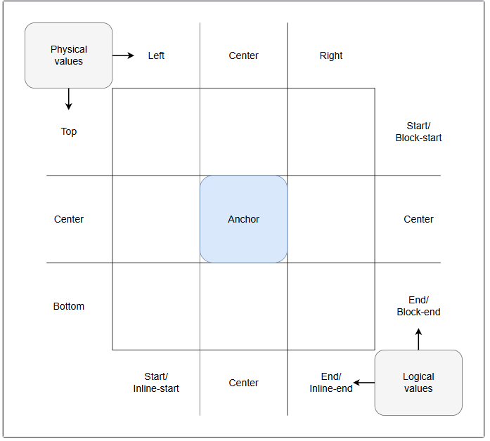

# position-area
`position-area` CSS 속성을 사용하면 앵커로 지정된 요소가 연결된 앵커 요소의 가장자리를 기준으로 위치를 지정할 수 있습니다. 이 속성은 앵커 요소가 중앙 셀인 암시적인 3x3 그리드의 하나 이상의 타일에 해당 요소를 배치합니다.  
  
`position-area`는 `inset` 속성이나 `anchor()` 함수를 사용하여 요소를 앵커 요소에 상대적으로 고정하고 배치하는 편리한 대안을 제공합니다. 이 그리드 기반 개념은 지정된 요소가 속한 블록의 가장자리를 기본 앵커 요소의 가장자리를 기준으로 배치하는 일반적인 사용 사례를 해결합니다.  
  
요소에 기본 앵커 요소가 없거나 절대 위치로 지정되지 않은 경우 이 속성은 아무런 효과가 없습니다.  
 
> __참고__: 이 속성은 원래 Chromium 브라우저에서 ``inset-area``라는 이름으로 지원되었으며, 속성 값은 동일했습니다. 하위 호환성을 위해 두 속성 이름 모두 당분간 지원될 예정입니다.

## Syntax
~~~css
/* 기본값 */
position-area: none;

/* 하나의 특정 타일을 정의하는 두 개의 <position-area> 키워드 */
position-area: top left;
position-area: start end;
position-area: block-start center;
position-area: inline-start block-end;
position-area: x-start y-end;

position-area: center self-y-end;

/* 두 개의 타일에 걸쳐 있는 두 개의 <position-area> 키워드 */
position-area: top span-left;
position-area: center span-start;
position-area: inline-start span-block-end;
position-area: y-start span-x-end;

/* 세 개의 타일에 걸쳐 있는 두 개의 <position-area> 키워드 */
position-area: top span-all;
position-area: block-end span-all;
position-area: self-x-start span-all;

/* 하나의 <position-area> 키워드와 암묵적으로 두 번째 <position-area> 키워드가 있는 경우 */
position-area: top; /* 동일: top span-all */
position-area: inline-start; /* 동일: inline-start span-all */
position-area: center; /* 동일: center center */
position-area: span-all; /* 동일: center center */
position-area: end; /* 동일: end end */

/* 전역 값 */
position-area: inherit;
position-area: initial;
position-area: revert;
position-area: revert-layer;
position-area: unset;
~~~

### Values
속성 값은 두 개의 ``<position-area>`` 키텀이거나 키워드 none입니다. ``<position-area>`` 키텀이 하나만 제공된 경우 두 번째 키텀은 암시적으로 사용됩니다.  
  
#### ``<position-area>``
선택한 위치 지정 요소를 배치할 위치 영역 그리드의 영역을 지정합니다.

#### none
위치 영역이 설정되지 않았습니다.

## Description
`position-area` 속성은 앵커를 기준으로 요소의 위치를 ​​지정하는 `anchor()` 함수의 대안을 제공합니다. `position-area`는 앵커 요소가 중앙 타일이 되는 3x3 타일 그리드(__position-area grid__ 라고 함) 개념을 기반으로 작동합니다.  
  
  
  
그리드 타일은 행과 열로 구성됩니다.  
  
- 세 개의 행은 각각 ``top``, ``center``, ``bottom``이라는 ``물리적 값``으로 표현됩니다. 또한 ``block-start``, ``center``, ``block-end``와 같은 ``논리적 값``과 ``y-start``, ``center``, ``y-end``와 같은 ``좌표 값``으로도 표현됩니다.
- 세 개의 열은 각각 ``left``, ``center``, ``right``라는 물리적 값으로 표현됩니다. 또한 ``inline-start``, ``center``, ``inline-end``와 같은 논리적 값과 ``x-start``, ``center``, ``x-end``와 같은 좌표 값으로도 표현됩니다.  
  
중앙 타일의 크기는 앵커 요소의 ``컨테이너 블록``에 의해 정의되고, 그리드의 바깥쪽 가장자리 크기는 위치 지정된 요소의 컨테이너 블록에 의해 정의됩니다.  
  
``<position-area>`` 값은 하나 또는 두 개의 키워드로 구성되며, 위치 지정된 요소가 배치될 그리드 영역을 정의합니다. 정확히 말하면, 위치 지정된 요소의 컨테이너 블록이 그리드 영역으로 설정됩니다.  
  
예를 들어:  
- 행 값과 열 값을 지정하여 특정 그리드 사각형 하나에 요소를 배치할 수 있습니다. 예를 들어, ``top left``(논리적으로 ``start start``와 동일) 또는 ``bottom center``(논리적으로 ``end center``와 동일)를 지정하면 요소가 각각 오른쪽 상단 또는 하단 중앙 사각형에 배치됩니다.
- 행 또는 열 값과 ``span-*`` 값을 함께 지정하여 두 개 또는 세 개의 셀에 걸쳐 배치할 수도 있습니다. 첫 번째 값은 요소를 배치할 행 또는 열을 지정하며, 처음에는 중앙에 배치됩니다. 두 번째 값은 해당 행 또는 열의 나머지 타일을 지정합니다. 예를 들어:
    - ``top span-left``는 요소를 맨 위 행의 중앙에 배치하고 해당 행의 중앙 및 왼쪽 타일에 걸쳐 배치합니다.
    - ``block-end span-inline-end``는 요소를 블록 끝 행의 중앙에 배치하고 해당 행의 중앙 및 끝 타일에 걸쳐 배치합니다.
    - `bottom span-all`과 `y-end span-all`을 사용하면 위치가 지정된 요소가 맨 아래 행의 중앙에 배치되고 세 개의 셀(이 경우 맨 아래 행의 왼쪽, 가운데, 오른쪽 타일)에 걸쳐 확장됩니다.  

앵커 기능, 사용법 및 `position-area` 속성에 대한 자세한 내용은 CSS 앵커 위치 지정 모듈과 CSS 앵커 위치 지정 사용 가이드, 특히 `position-area` 설정 섹션을 참조하십시오.

### 조정된 기본 동작
위치 지정 요소에 `<position-area>` 값을 설정하면 해당 요소의 일부 속성 기본 동작이 조정되어 적절한 기본 정렬이 제공됩니다.

#### 자체 정렬 속성 정규값
``align-items``, ``align-self``, ``justify-items``, ``justify-self``를 포함한 자체 정렬 속성의 기본 값은 ``start``, ``end`` 또는 ``anchor-center`` 중 하나입니다. 자체 정렬 속성의 기본값은 요소의 위치에 따라 달라집니다.
- ``position-area`` 값이 축의 중심 영역을 지정하는 경우 해당 축의 기본 정렬은 ``anchor-center``입니다.
- 그렇지 않으면, 동작은 ``position-area`` 속성으로 지정된 영역의 반대가 됩니다. 예를 들어, ``position-area`` 값이 축의 시작 영역을 지정하는 경우 해당 축의 기본 정렬은 ``end``입니다.  
  
예를 들어, 쓰기 모드가 ``horizontal-tb``로 설정된 경우, ``position-area: top span-x-start``를 사용하면 위치가 지정된 요소가 맨 위 행의 중앙에 배치되고 해당 행의 중앙 타일과 시작 타일에 걸쳐 확장됩니다. 이 경우 자체 정렬 속성은 기본적으로 ``align-self: end`` 및 ``justify-self: anchor-center``로 설정됩니다.

#### 삽입 속성 및 값
앵커로 배치된 요소가 `position-area` 속성을 사용하여 배치될 때, `top`이나 `inset-inline-end`와 같은 인셋 속성은 `position-area`를 기준으로 한 오프셋 값을 지정합니다. `max-block-size: 100%`와 같은 다른 속성 값도 `position-area`를 기준으로 상대적인 값을 가집니다. `inset` 속성이 설정되었거나 기본값이 `auto`인 경우, 해당 속성 값은 `0`으로 설정된 것처럼 동작합니다.

#### 위치 지정된 요소 너비에 대한 여담
위치가 지정된 요소에 특정 크기가 설정되어 있지 않으면 해당 요소의 크기는 기본적으로 고유 크기로 설정되지만, `position-area` 그리드의 크기에도 영향을 받습니다.  
  
위치 지정 요소가 상단 중앙, 하단 중앙 또는 중앙 정렬된 단일 셀에 배치되면 해당 요소의 블록 크기는 앵커 요소가 속한 블록 크기와 동일하며, 각각 위쪽, 아래쪽 또는 양쪽 방향으로 확장됩니다. 위치 지정 요소는 지정된 그리드 사각형에 맞춰 정렬되지만 앵커 요소와 동일한 너비를 갖습니다. 단, 콘텐츠가 넘치지 않도록 하며, 최소 ``width``는 ``min-content``(가장 긴 단어의 너비로 정의됨)가 됩니다.  
  
위치가 지정된 요소가 다른 단일 그리드 영역(예: `position-area: top left`)에 배치되거나 두 개 이상의 그리드 영역에 걸쳐 배치되도록 설정된 경우(예: `position-area: bottom span-all`), 지정된 그리드 영역에 맞춰 정렬되지만 너비가 `max-content`로 설정된 것처럼 동작합니다. 즉, 해당 요소는 포함하는 블록의 크기에 따라 크기가 조정되는데, 이 크기는 `position: fixed`로 설정되었을 때 적용된 크기입니다. 요소는 텍스트 내용만큼 넓어지지만, `<body>`의 가장자리에 의해 제한될 수도 있습니다.

### position-area를 사용하여 팝오버 위치 지정
`position-area`를 사용하여 `` popovers``의 위치를 ​​지정할 때, ``팝오버의 기본 스타일``이 원하는 위치와 충돌할 수 있다는 점에 유의해야 합니다. 일반적으로 문제가 되는 것은 여백(``margin``)과 삽입(``inset``)의 기본 스타일이므로, 이러한 스타일을 재설정하는 것이 좋습니다.
~~~css
.my-popover {
    margin: 0;
    inset: auto;
}
~~~
CSS 워킹 그룹은 이러한 해결 방법을 사용하지 않아도 되는 방안을 모색하고 있습니다.

## Examples
### Basic example
이 예제에서는 ``position-area`` 속성을 사용하여 위치가 지정된 요소가 연결된 앵커를 기준으로 배치됩니다.

#### HTML
HTML에는 ``
``와 ``
``가 포함되어 있습니다. ``
``는 CSS를 사용하여 ``
``를 기준으로 상대적인 위치에 배치됩니다. 또한 표시될 스타일 블록도 포함되어 있습니다. 모든 요소는 ``contenteditable`` 속성을 통해 직접 편집할 수 있도록 설정되어 있습니다.
~~~html

⚓︎

This can be edited.

~~~

#### CSS
``
`` 요소를 ``anchor-name`` 속성을 사용하여 앵커 요소로 변환합니다. 그런 다음 절대 위치로 지정된 ``
`` 요소의 ``position-anchor`` 값을 동일한 앵커 이름으로 설정하여 해당 요소와 연결합니다.  
  
초기 `position-area` 값은 상단 중앙으로 설정됩니다. 이 값은 `p` 선택자에 설정되므로 `<style>` 블록의 `.positionedElement` 클래스 선택자에 추가된 값보다 우선순위가 낮습니다. 따라서 스타일 블록 내부에 `position-area` 값을 설정하여 초기 값을 재정의할 수 있습니다.
~~~css
.anchor {
    anchor-name: --infobox;
    background: palegoldenrod;
    font-size: 3em;
    width: fit-content;
    border: 1px solid goldenrod;
    margin: 100px auto;
}

p {
    position: absolute;
    position-anchor: --infobox;
    position-area: top center;
    margin: 0;
    background-color: darkkhaki;
    border: 1px solid darkolivegreen;
}

style {
    display: block;
    white-space: pre;
    font-family: monospace;
    background-color: #ededed;
    -webkit-user-modify: read-write-plaintext-only;
    line-height: 1.5;
    padding: 10px;
}
~~~

#### Results
[예제 확인](https://developer.mozilla.org/en-US/play?uuid=10f45bfc51efc0335f5d73c3d3a56d3695f8a11d&state=fVJLrhMxELxKy2zjfITYOHnZcQOWs%2FGMOzPNeLot2%2FnxlCuwYcdJOA8X4ArIY8LnoTx5Y3WpqqvKflZDnrwyaufoBJ23KT01ynI3SGwUdMIZOaOjbFuPT43K8YiN2n%2F%2F%2BuXHt8%2B7laPTvuGGd%2BE3OUiiTMLo3nuckPNrOh8GStBZhhahoOiWu1WokilfPT6mLv9bBM8NAwDcAW0jWgNZAnRFIm4Lfmt4t5q19w2rhepSUkYta%2BYqUe%2Ba7YQGtCY%2BSCuXmd3abuyjHNkZCNZjL94hR3EzehDOOtEnNPAWp3l0JpcHAwfK%2BleUqiPRYTSwCRdI4snBv0qTjT2xgc16HS5gj1m2Dd9KL6F6vIc0YNsk%2Fphx%2B%2FdY1wwv7b9ezX3p%2BkVU3YkvWs7GcRzsSA8iFFw8nbCPiHw3XN9xNu0oBW%2BvBlov3Vj7GSijTsF2aCBE%2FNPjwU7krwYmYZnxB67eoCtnRvUZ25GyPiaMehJHh6uBiNbpcyx7grfEGS9ZC%2FvrTPHEqAekfsgGNst3tSfrHHFf%2Bg%2BXGkQt1MfyU9RC5QEnVEb5QlK3nw%3D%3D&srcPrefix=%2Fen-US%2Fdocs%2FWeb%2FCSS%2FReference%2FProperties%2Fposition-area%2F)  
  
앵커로 고정된 요소의 텍스트 양을 변경하여 어떻게 커지는지 확인해 보세요. 또한, ``position-area`` 속성 값을 ``center``와 같은 다른 값으로 변경해 보는 것도 좋습니다.

### position-area 값 비교
이 데모는 앵커를 생성하고 위치를 지정한 요소를 해당 앵커에 연결합니다. 또한 드롭다운 메뉴를 제공하여 위치를 지정한 요소에 적용할 다양한 `position-area` 값을 선택하고 그 효과를 확인할 수 있습니다. 옵션 중 하나를 선택하면 텍스트 필드가 나타나 사용자 지정 값을 입력할 수 있습니다. 마지막으로, `writing-mode: vertical-lr` 속성을 켜고 끌 수 있는 체크박스가 제공되어, 다양한 쓰기 모드에서 `position-area` 값의 효과가 어떻게 달라지는지 관찰할 수 있습니다.

#### HTML
HTML에서 우리는 `anchor` 클래스와 `infobox` 클래스가 있는 두 개의 `
` 요소를 지정합니다. 이 두 요소는 각각 앵커 요소와 해당 앵커 요소에 연결될 위치 지정 요소로 사용될 것입니다. 두 요소 모두에 `contenteditable` 속성을 추가하여 직접 편집할 수 있도록 했습니다.  
  
또한, ``position-area`` 값을 설정할 수 있는 ``<select>`` 및 ``<input type="text">`` 요소가 포함된 두 개의 폼과, 세로 쓰기 모드를 켜고 끌 수 있는 ``<input type="checkbox">`` 요소가 포함된 폼을 추가했습니다. 간결성을 위해 이러한 요소와 JavaScript 코드는 숨겨져 있습니다.
~~~html

⚓︎

  
You can edit this text.

~~~

#### CSS
CSS에서 먼저 ``anchor-name`` 속성을 통해 앵커 이름을 설정하여 ``
`` 앵커 요소를 ``anchor``로 선언합니다.  
  
위치 지정 요소는 해당 요소의 `position-anchor` 속성 값으로 앵커 이름을 설정하여 앵커 요소와 연결됩니다. 또한 `position-area: top left`로 초기 위치를 지정합니다. 이 초기 위치는 `<select>` 메뉴에서 새 값을 선택하면 덮어쓰여집니다. 마지막으로, 위치 지정 요소의 `opacity` 값을 0.8로 설정하여, 위치 지정 요소가 앵커 요소 위에 위치하도록 `position-area` 값을 지정하더라도 요소들의 상대적인 위치를 확인할 수 있도록 합니다.
~~~css
.anchor {
    anchor-name: --my-anchor;
}

.infobox {
    position-anchor: --my-anchor;
    position: fixed;
    opacity: 0.8;
    position-area: top left;
}
~~~

#### Result
결과는 다음과 같습니다.  
[예제 확인](https://developer.mozilla.org/en-US/play?uuid=dc5285c629d99b1e699347b7b587b0dec46afa2a&state=rVjbjts2EP2VgYIAG2Ble9MuGii2gWKbog8pUCDoQwG9UOLYYpYiVZLyJcH%2BQl761i%2Fp9%2FQH%2BgsFL7qtZcVJdoEF1uOZM2duHHI%2FRoUpeZRES8p2kHOi9SqNiMgLqdIIcikMCoOUGZJxXP%2F791%2F%2F%2FfNpOadst05FKgZWTGxkJg9ptE4FwLI6sf5D1pATAVYApmAaDB7MbDmv1qloQJcbqUpgdJVGldTMMCliopDEVt5ge1UAgCUnGXLYSHVioJFjbtJofVdIqREIDL5PlnNn2wB59THPDRAIUuJ5Nx4HYCkrs1WyrsDhr9LojTCoIK%2B1kSXsCK%2Bxp%2B4NmBTrO6ewnIePLd68AZxw8Vtx1Cwn%2FBo0E1uOYBgf9QKeL9K1kRVw3JgThx2jTBpLWbFtcar2pbwqIsDs5WjowZHVice9dbqWs9c0snoSVoTzUVZj%2BEMeX%2Bf%2BrdxeVKu1NkQZyO0QqQkmTHAmMPbaGZf5fYyCfiu3qXp5V64IY546Rc%2FdazqjS8NwFudj6VHpFCfT9RXRn%2BuLHkPC%2BdT8fFst7qRUlAliUH%2B%2BVw7T4fcVUVA4PhWtqTbpV%2F%2F42fof%2B6U%2FPCW%2Fc4U8xBeX8sJ8Lef%2BfPV7at4sKrcoR1aL3wmx3ZSECVQty4m95m3SaO3XCmkWy%2Bh282jrZaZg3kAzUdUGzLGyy8yu4DQ6z%2B3c2mu%2FnQ9CXc7tnvaXg26T7xUzTGzjUlIcLPJ%2BlAOlvMD83t8m%2BvIEdqiMHdGYq2aBd8H50HyYIb4OyItP%2BTzWCOGe0XGe2iij6yjXOkqimb8zwUeLsZHCxJp9wARuZq8Ulq%2Bt1GY6JpxtRRKG1IlzyaVKYF8wg52eLgiV%2BwRuqkP7m3GS3zuVjOT3tusEjYN5ofnVy%2B8XcLNYPIcfbp%2B%2FcHolE%2FGeUVMkcLuoDq2sQLtje0J38J5IM6koqlgRymqdwM1Q7slpyRntUasIpUxsE%2FjOKT%2FYTrB3TJ%2BZxoWl2XybSXr035ZEbZlIYOGQAvGbxWK3f%2F3IeFc4CWW64uSYwIajp%2Fa%2B1oZtjnG4ew4y7XIfM4Ol7skdB9eqH4ep7dfkoohvQ3qaQUlgww5IGx%2FPTu%2Bz3qWRVROz8hG%2B7HI3ZkXZLuFEmzgvGKf93MUOKxRqyh4mAW579iezG%2FLkbmwNb3sXamgDDCe2kIp9sAccj012htbjc9D7aMsrpMDGchbeGV4ltD8l6j7jNZ6ZDvKhVucK%2BYy6n5NSttE8moKmyv0hb0Y8kwcrchDBLJMhlYMTwv8d26MmgTguj7GXjAfZ5copPbYY6zgAWZGcmWMCi9mr10MUux%2Bguf57l9F19N6eY7kU2gR6d201VkBlXpcozOzPGtXxndtxUl2lkZ3eNLLHjTdtiE%2BYzNqXojVrDBt6PyokP9s2m0AYaeo%2BB7%2BC33CcBGkebn3uVe3MLolcAJwQOV3n16kYwf%2BC2Jo926E0u%2BizQGc2mE%2F6fA7vbAu4id4o%2B%2Fiqs5IZawH7AgX4uxvTUCnUGilIAcyk4nGhZoTSNzsU5i3TBgW63DqsNLqGK3wBq7XvY5xVCq3mT7ghNTdXlspDy%2Bf3ihKDbSMgBeRoQxu2LhjpH9HtUxaYAKpkFVO5F6noyj9GLS%2BI2KKj1jELbW%2FRV732mTk%2Fjh8A28CV11itII3umsJ4BACb0ULuwRQ4eOv7ssOGIafhDnLSZzNtjhxn4cADi%2B%2FeDmnkRvcBkGvsOfqFUXwqR%2FZwDX58EGgc9EnSrdA7ygupUdi0W1n4z4ltruDVjXdw1W8XWLkc%2B5i%2BsvSuLZEO%2F50i2ki%2FsOQeJXDrQPp1vywlIRe%2BBCEVk4noPA%2BG4M5xHaxQ66gkJi%2Fa0QeNblBT0T8MLg7ddvLA0H1A2rbyo%2FM%2FBBA4%2FWop2cbpXcVH%2B%2FQylMH1oMEJGYmuI1NgiVEScXszih7%2BBw%3D%3D&srcPrefix=%2Fen-US%2Fdocs%2FWeb%2FCSS%2FReference%2FProperties%2Fposition-area%2F)  
  
``<select>`` 메뉴에서 새로운 ``position-area`` 값을 선택하여 정보 상자의 위치에 어떤 영향을 미치는지 확인해 보세요. "사용자 지정" 값을 선택하고 텍스트 입력란에 사용자 지정 ``position-area`` 값을 입력하여 그 효과를 살펴보세요. 앵커 요소와 앵커가 배치된 요소에 텍스트를 추가하여 ``position-area`` 값에 따라 앵커 요소가 어떻게 변하는지 확인해 보세요. 마지막으로 확인란을 선택한 다음 다양한 ``position-area`` 값을 입력해 보고, 어떤 값이 여러 쓰기 모드에서 동일한 결과를 나타내는지, 어떤 값이 다른 결과를 나타내는지 확인해 보세요.  
  
  

[내용 출처 MDN anchor를 사용할 때 위치 조정](https://developer.mozilla.org/en-US/docs/Web/CSS/Reference/Properties/position-area)