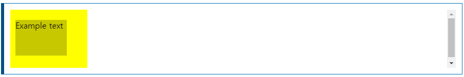

# inset
__``inset``__ CSS 속성은 위쪽, 오른쪽, 아래쪽 및/또는 왼쪽 속성에 해당하는 축약형입니다. margin 속기의 다중 값 구문과 동일합니다.  
  
CSS 논리적 속성 사양의 일부이지만 논리적 오프셋을 정의하지 않습니다. 요소의 쓰기 모드, 방향 및 텍스트 방향에 관계없이 물리적 오프셋을 정의합니다.
~~~css
/* <길이> 값 */
inset: 10px; /* 모든 모서리에 적용되는 값 */
inset: 4px 8px; /* 위/아래 왼쪽/오른쪽 */
inset: 5px 15px 10px; /* 왼쪽 위/오른쪽 아래 */
inset: 2.4em 3em 3em 3em; /* 오른쪽 위 왼쪽 아래 */

/* 포함하는 블록의 너비(왼쪽/오른쪽) 또는 높이(상단/하단)의 <백분율> */
inset: 10% 5% 5% 5%;

/* 키워드 값 */
inset: auto;

/* 전역 값 */
inset: inherit;
inset: initial;
inset: revert;
inset: unset;
~~~

## Syntax ( 문법 )
### Valuse
inset 속성은 left 속성과 동일한 값을 사용합니다

## 형식적 정의
초기값 : auto  
적용 : position이 적용된 elements  
상속 : X  
백분율 : 해당 축에서 포함하는 블록의 크기에 상대적 (예 : 왼족 또는 오른쪽의 너비, 위쪽 또는 아래쪽의 높이)  
계산된 값 : 상자 오프셋과 동일 : 방향이 논리적이라는 점을 제외하고 top, right, bottom, left 속성  
애니메이션 유형 : 길이, 백분율 또는 calc() 입니다.  

## 형식적 구문
> ``<'top'>``{1,4}

## 예제 
요소에 대한 오프셋 설정

### html
~~~html
    

        Example text
    

~~~

### css
~~~css
div {
    background-color: yellow;
    width: 150px;
    height: 120px;
    position: relative;
}

.exampleText {
    writing-mode: sideways-rl;
    position: absolute;
    inset: 20px 40px 30px 10px;
    background-color: #c8c800;
}
~~~

### result

[내용출처 MDN css inset](https://developer.mozilla.org/en-US/docs/Web/CSS/inset)
