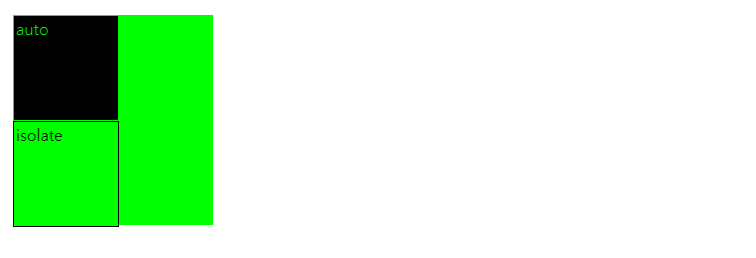

# isolation ( 격리 )
``isolation`` CSS 속성은 요소가 __새로운 쌓임 맥락__ 을 생성해야 하는지 지정합니다.  
  
``mix-blend-mode``와 함께 사용했을 때 특히 유용합니다.

## 구문
~~~css
/* 키워드 값 */
isolation: auto;
isolation: isolate;

/* 전역 값 */
isolation: inherit;
isolation: initial;
isolation: unset;
~~~
``isolation`` 속성은 다음 키워드 값 중 하나를 사용해 지정합니다.

### 값
#### auto
요소에 적용한 속성 중 새로운 쌓임 맥락을 요구하는 속성이 있을 때만 쌓임 맥락을 생성합니다.

#### isolate
항상 새로운 쌓임 맥락을 생성합니다.

## 예제
~~~html

  

    
auto

  

  

    
isolate

  

~~~
~~~css
.a {
  background-color: rgb(0,255,0);
}
#b {
  width: 200px;
  height: 210px;
}
.c {
  width: 100px;
  height: 100px;
  border: 1px solid black;
  padding: 2px;
  mix-blend-mode: difference;
}
#d {
  isolation: auto;
}
#e {
  isolation: isolate;
}
~~~

## 사용예
::before , ::after 로 뒤에 깔아야할 때 (z-index : -1) 뒷 배경 태그가 배경을 가지고 있을 때 사용하면 좋을 듯

[내용출처 MDN 요소(tag)가 새로운 쌓임 맥락을 생성](https://developer.mozilla.org/ko/docs/Web/CSS/isolation)
