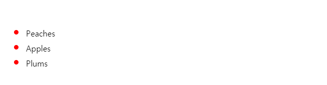

# ::marker
``::marker`` CSS 의사 요소는 일반적으로 글 머리 기호 또는 숫자를 포함하는 목록 항목의 마커 상자를 선택합니다. ``display: list-item``일 때, ``<li>`` 및 ``
`` 요소와 같은 목록 항목.
~~~css
::marker {
  color: blue;
  font-size: 1.2em;
}
~~~

## 허용 가능한 속성
``::marker`` 를 선택기로 사용하는 규칙에서는 특정 CSS 속성 만 사용할 수 있습니다.
- [모든 글꼴 속성](https://developer.mozilla.org/en-US/docs/Web/CSS/CSS_Fonts)
- [공백 속성 ``white-space``](https://developer.mozilla.org/en-US/docs/Web/CSS/white-space)
- [색깔 color](https://developer.mozilla.org/en-US/docs/Web/CSS/color)
- [text-combine-upright](https://developer.mozilla.org/en-US/docs/Web/CSS/text-combine-upright), [unicode-bidi](https://developer.mozilla.org/en-US/docs/Web/CSS/unicode-bidi) 및 [방향 속성 direction](https://developer.mozilla.org/en-US/docs/Web/CSS/direction)
- [콘텐츠 속성](https://developer.mozilla.org/en-US/docs/Web/CSS/content)
- 모든 [애니메이션](https://developer.mozilla.org/en-US/docs/Web/CSS/CSS_Animations#css_properties) 및 [전환 속성](https://developer.mozilla.org/en-US/docs/Web/CSS/CSS_Transitions#properties)

> 사양에는 추가 CSS 속성이 향후 지원 될 수 있다고 명시되어 있습니다.

## 문법
~~~css
::marker
~~~

## Examples (예제)

### HTML
~~~html
<ul>
    <li>Peaches</li>
    <li>Apples</li>
    <li>Plums</li>
</ul>
~~~

### CSS
~~~css
ul li::marker {
    color: red;
    font-size: 1.5em;
}
~~~

### Result
  
  
  
> 호환성 꼭 MDN 사이트 참조 (ie 지원 불가)

[내용출처 MDN ::marker](https://developer.mozilla.org/en-US/docs/Web/CSS/::marker)