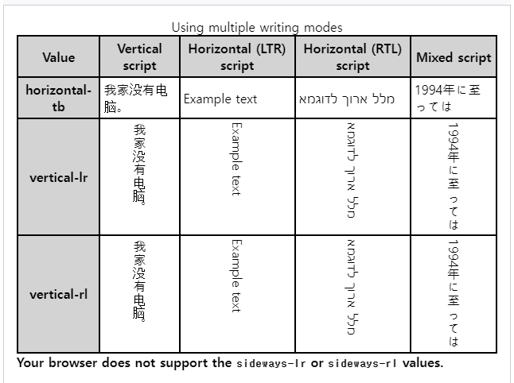

# writing-mode
쓰기 모드 CSS 속성은 텍스트 줄을 가로 또는 세로로 배치할지 여부와 블록이 진행되는 방향을 설정합니다. 전체 문서에 대해 설정하는 경우 루트 요소(HTML 문서의 경우 html 요소)에 설정해야 합니다.

## 예
[MDN 사이트](https://developer.mozilla.org/en-US/docs/Web/CSS/writing-mode)

이 속성은 블록 수준 컨테이너가 쌓이는 방향인 블록 흐름 방향과 블록 컨테이너 내에서 인라인 수준 콘텐츠가 흐르는 방향을 지정합니다. 따라서 블록 수준 콘텐츠의 순서도 결정합니다.

## 문법
~~~css
/* Keyword values */
writing-mode: horizontal-tb;
writing-mode: vertical-rl;
writing-mode: vertical-lr;

/* Global values */
writing-mode: inherit;
writing-mode: initial;
writing-mode: revert;
writing-mode: revert-layer;
writing-mode: unset;
~~~
쓰기 모드 속성은 아래 나열된 값 중 하나로 지정됩니다. 가로 스크립트의 흐름 방향은 해당 스크립트의 방향, 즉 왼쪽에서 오른쪽(ltr, 영어 및 대부분의 다른 언어와 마찬가지로) 또는 오른쪽에서 왼쪽(rtl, 히브리어 또는 아랍어)의 영향을 받습니다.

## 값
### horizontal-tb
ltr 스크립트의 경우 콘텐츠는 왼쪽에서 오른쪽으로 수평으로 흐릅니다. rtl 스크립트의 경우 콘텐츠는 오른쪽에서 왼쪽으로 수평으로 흐릅니다. 다음 수평선은 이전 줄 아래에 위치합니다.

### vertical-rl
ltr 스크립트의 경우 콘텐츠는 위에서 아래로 수직으로 흐르며 다음 수직선은 이전 줄의 왼쪽에 배치됩니다. rtl 스크립트의 경우 콘텐츠는 아래에서 위로 수직으로 흐르며 다음 수직선은 이전 줄의 오른쪽에 배치됩니다.

### vertical-lr
ltr 스크립트의 경우 콘텐츠는 위에서 아래로 수직으로 흐르며 다음 수직선은 이전 줄의 오른쪽에 배치됩니다. rtl 스크립트의 경우 콘텐츠는 아래에서 위로 수직으로 흐르며 다음 수직선은 이전 줄의 왼쪽에 위치합니다.

### sideways-rl
ltr 스크립트의 경우 콘텐츠는 위에서 아래로 수직으로 흐릅니다. rtl 스크립트의 경우 콘텐츠는 아래에서 위로 수직으로 흐릅니다. 모든 글리프는 수직 스크립트의 글리프라도 오른쪽 옆으로 설정됩니다.

### sideways-lr
ltr 스크립트의 경우 콘텐츠는 아래에서 위로 수직으로 흐릅니다. rtl 스크립트의 경우 콘텐츠는 위에서 아래로 수직으로 흐릅니다. 모든 글리프는 수직 스크립트의 글리프라도 왼쪽을 향해 옆으로 설정됩니다.

### lr
SVG1 문서를 제외하고 더 이상 사용되지 않습니다. CSS의 경우 대신에horizontal-tb를 사용하세요.

### lr-tb
SVG1 문서를 제외하고 더 이상 사용되지 않습니다. CSS의 경우 대신에horizontal-tb를 사용하세요.

### rl
SVG1 문서를 제외하고 더 이상 사용되지 않습니다. CSS의 경우 대신에horizontal-tb를 사용하세요.

### tb
SVG1 문서를 제외하고 더 이상 사용되지 않습니다. CSS의 경우 대신 Vertical-lr을 사용하세요.

### tb-lr
SVG1 문서를 제외하고 더 이상 사용되지 않습니다. CSS의 경우 대신 Vertical-lr을 사용하세요.

### tb-rl
SVG1 문서를 제외하고 더 이상 사용되지 않습니다. CSS의 경우 대신 Vertical-rl을 사용하세요.

## 예
### 다양한 쓰기 모드 사용
이 예에서는 모든 쓰기 모드를 보여 주며 각 모드에는 다양한 언어의 텍스트가 표시됩니다.

### HTML
HTML은 행에 각 쓰기 모드가 있는 ``<table>``이며 해당 쓰기 모드를 사용하는 다양한 스크립트의 텍스트를 표시하는 열이 있습니다.
~~~html
<table>
    <caption>
        Using multiple writing modes
    </caption>
    <tr>
        <th>Value</th>
        <th>Vertical script</th>
        <th>Horizontal (LTR) script</th>
        <th>Horizontal (RTL) script</th>
        <th>Mixed script</th>
    </tr>
    <tr class="text1">
        <th>horizontal-tb</th>
        <td>我家没有电脑。</td>
        <td>Example text</td>
        <td>מלל ארוך לדוגמא</td>
        <td>1994年に至っては</td>
    </tr>
    <tr class="text2">
        <th>vertical-lr</th>
        <td>我家没有电脑。</td>
        <td>Example text</td>
        <td>מלל ארוך לדוגמא</td>
        <td>1994年に至っては</td>
    </tr>
    <tr class="text3">
        <th>vertical-rl</th>
        <td>我家没有电脑。</td>
        <td>Example text</td>
        <td>מלל ארוך לדוגמא</td>
        <td>1994年に至っては</td>
    </tr>
    <tr class="experimental text4">
        <th>sideways-lr</th>
        <td>我家没有电脑。</td>
        <td>Example text</td>
        <td>מלל ארוך לדוגמא</td>
        <td>1994年に至っては</td>
    </tr>
    <tr class="experimental text5">
        <th>sideways-rl</th>
        <td>我家没有电脑。</td>
        <td>Example text</td>
        <td>מלל ארוך לדוגמא</td>
        <td>1994年に至っては</td>
    </tr>
</table>

    Your browser does not support the <code>sideways-lr</code> or
    <code>sideways-rl</code> values.

~~~
### CSS
콘텐츠의 방향성을 조정하는 CSS는 다음과 같습니다.
~~~css
.text1 td {
    writing-mode: horizontal-tb;
}

.text2 td {
    writing-mode: vertical-lr;
}

.text3 td {
    writing-mode: vertical-rl;
}

.text4 td {
    writing-mode: sideways-lr;
}

.text5 td {
    writing-mode: sideways-rl;
}
~~~

### 결과

## 변환과 함께 쓰기 모드 사용
브라우저가 sideways-lr을 지원하지 않는 경우 해결 방법은 변환을 사용하여 스크립트 방향에 따라 유사한 효과를 얻는 것입니다. Vertical-rl의 효과는 sideways-lr과 동일하므로 왼쪽에서 오른쪽으로 스크립트를 변환할 필요가 없습니다. 경우에 따라 텍스트를 180도 회전하면 sideways-lr 효과를 얻을 수 있지만 글꼴 글리프는 회전되도록 설계되지 않을 수 있으므로 예상치 못한 위치 지정이나 렌더링이 발생할 수 있습니다.