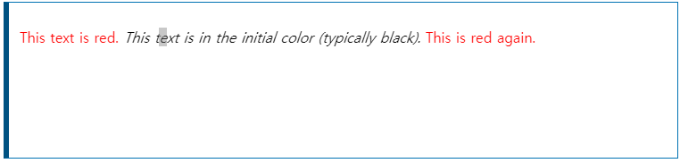

# initial
CSS __``initial``__ 키워드는 속성의 초깃값(기본값)을 요소에 적용합니다. 초깃값은 브라우저가 지정합니다. 모든 속성에서 사용할 수 있으며, [all](https://developer.mozilla.org/ko/docs/Web/CSS/all)에 지정할 경우 모든 CSS 속성을 초깃값으로 재설정합니다.

> __참고__: 상속 속성의 초깃값은 예상치 못한 값일 수도 있습니다. 따라서, [inherit](https://developer.mozilla.org/ko/docs/Web/CSS/inherit), [unset](https://developer.mozilla.org/ko/docs/Web/CSS/unset), [revert](https://developer.mozilla.org/ko/docs/Web/CSS/revert) 키워드의 사용을 대신 고려해보세요.

## 예제
### HTML
~~~html

    This text is red.
    <em>This text is in the initial color (typically black).</em>
    This is red again.

~~~
### css
~~~css
p {
  color: red;
}
em {
  color: initial;
}
~~~

[CSS initial 초기값](https://developer.mozilla.org/ko/docs/Web/CSS/initial)
