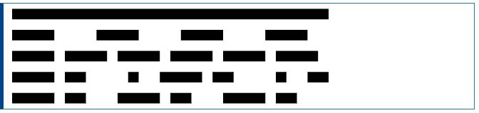

# stroke-dasharray
__``stroke-dasharray``__ 속성은 모양의 윤곽선을 그리는 데 사용되는 대시 및 간격의 패턴을 정의하는 표현 속성입니다.  
  
__참고 :__ 프리젠테이션 속성으로 __``stroke-dasharray``__ 를 CSS 속성으로 사용할 수 있습니다.  
  
프레젠테이션 속성으로 모든 요소에 적용 할 수 있지만 다음 12개 요소에서만 영향을 줍니다.  
  
- [``<altGlyph>``](https://developer.mozilla.org/en-US/docs/Web/SVG/Element/altGlyph)
- [``<circle>``](https://developer.mozilla.org/en-US/docs/Web/SVG/Element/circle)
- [``<ellipse>``](https://developer.mozilla.org/en-US/docs/Web/SVG/Element/ellipse)
- [``<path>``](https://developer.mozilla.org/en-US/docs/Web/SVG/Element/path)
- [``<line>``](https://developer.mozilla.org/en-US/docs/Web/SVG/Element/line)
- [``<polygon>``](https://developer.mozilla.org/en-US/docs/Web/SVG/Element/polygon)
- [``<polyline>``](https://developer.mozilla.org/en-US/docs/Web/SVG/Element/polyline)
- [``<rect>``](https://developer.mozilla.org/en-US/docs/Web/SVG/Element/rect)
- [``<text>``](https://developer.mozilla.org/en-US/docs/Web/SVG/Element/text)
- [``<textPath>``](https://developer.mozilla.org/en-US/docs/Web/SVG/Element/textPath)
- [``<tref>``](https://developer.mozilla.org/en-US/docs/Web/SVG/Element/tref)
- [``<tspan>``](https://developer.mozilla.org/en-US/docs/Web/SVG/Element/tspan)

~~~html
<svg viewBox="0 0 30 10" xmlns="http://www.w3.org/2000/svg">
  <!-- No dashes nor gaps -->
  <line x1="0" y1="1" x2="30" y2="1" stroke="black" />

  <!-- Dashes and gaps of the same size -->
  <line x1="0" y1="3" x2="30" y2="3" stroke="black"
          stroke-dasharray="4" />

  <!-- Dashes and gaps of different sizes -->
  <line x1="0" y1="5" x2="30" y2="5" stroke="black"
          stroke-dasharray="4 1" />

  <!-- Dashes and gaps of various sizes with an odd number of values -->
  <line x1="0" y1="7" x2="30" y2="7" stroke="black"
          stroke-dasharray="4 1 2" />

  <!-- Dashes and gaps of various sizes with an even number of values -->
  <line x1="0" y1="9" x2="30" y2="9" stroke="black"
          stroke-dasharray="4 1 2 3" />
</svg>
~~~

## Usage notes 사용법 참조
__Value 값__ : none | ``<dasharray>``  
__default value__ : none  
__Animatable__ : Yes  
  
### ``<dasharray>``
쉼표 및 / 또는 공백으로 구분된 ``<length>`` 및 ``<percentage>`` 의 목록으로 대체 대시 및 간격의 길이를 지정합니다.  
  
홀수 값이 제공되면 값 목록이 반복되어 짝수 값이 생성됩니다. 따라서 5,3,2는 5,3,2,5,3,2와 같습니다.

[내용출처 MDN stroke-dasharray](https://developer.mozilla.org/en-US/docs/Web/SVG/Attribute/stroke-dasharray)