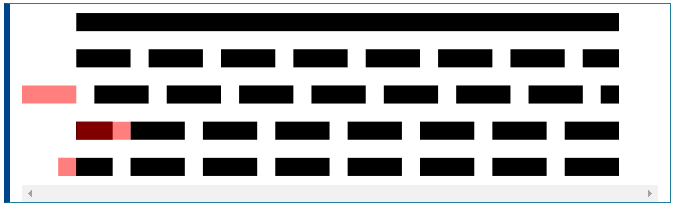

# stroke-dashoffset
__stroke-dashoffset__ 속성은 연관된 대시 배열의 렌더링에서 오프셋을 정의하는 표시 속성입니다.  
  
__참고 :__ 프레젠테이션 속성으로 ``stroke-dashoffset`` 을 CSS 속성으로 사용할 수 있습니다.  
  
프레젠테이션 속성으로 모든 요소에 적용 할 수 있지만 ``<altGlyph>``, ``<circle>``, ``<ellipse>``, ``<path>``, ``<line>``, ``<polygon>``, ``<polyline>``과 같은 12 개의 요소에만 영향을 미칩니다. , ``<rect>``, ``<text>``, ``<textPath>``, ``<tref>`` 및 ``<tspan>``  
  
~~~html
<svg viewBox="-3 0 33 10" xmlns="http://www.w3.org/2000/svg">
  <!-- No dash array -->
  <line x1="0" y1="1" x2="30" y2="1" stroke="black" />

  <!-- No dash offset -->
  <line x1="0" y1="3" x2="30" y2="3" stroke="black"
        stroke-dasharray="3 1" />

  <!--
  The start of the dash array computation
  is pulled by 3 user units
  -->
  <line x1="0" y1="5" x2="30" y2="5" stroke="black"
        stroke-dasharray="3 1"
        stroke-dashoffset="3" />

  <!--
  The start of the dash array computation
  is pushed by 3 user units
  -->
  <line x1="0" y1="7" x2="30" y2="7" stroke="black"
        stroke-dasharray="3 1"
        stroke-dashoffset="-3" />

  <!--
  The start of the dash array computation
  is pulled by 1 user units which ends up
  in the same rendering as the previous example
  -->
  <line x1="0" y1="9" x2="30" y2="9" stroke="black"
        stroke-dasharray="3 1"
        stroke-dashoffset="1" />

  <!--
  the following red lines highlight the
  offset of the dash array for each line
  -->
  <path d="M0,5 h-3 M0,7 h3 M0,9 h-1" stroke="rgba(255,0,0,.5)" />
</svg>
~~~

## Usage notes 사용자 사용법
__Value :__ [``<percentage>``](https://developer.mozilla.org/en-US/SVG/Content_type#Percentage) | [``<length>``](https://developer.mozilla.org/en-US/SVG/Content_type#Length)  
__default value :__ 0  
__Animatable :__ Yes  
  
오프셋은 이발전으로 [``pathLength``](https://developer.mozilla.org/en-US/docs/Web/SVG/Attribute/pathLength)에 대해 확인된 사용자 단위로 표현되지만 ``<percentage>``가 사용되면 값은 현재 뷰포트의 백분율로 확인됩니다.

[내용출처 MDN stroke-dashoffset](https://developer.mozilla.org/en-US/docs/Web/SVG/Attribute/stroke-dashoffset)