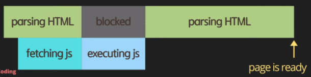
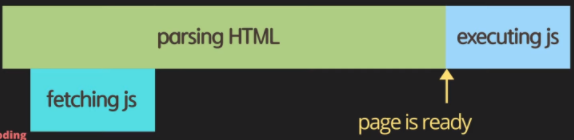

# ``
</head>
<body>
    
</body>
</html>
~~~

##### result

~~~html
<!DOCTYPE html>
<html lang="en">
<head>
    <meta charset="UTF-8">
    <meta http-equiv="X-UA-Compatible" content="IE=edge">
    <meta name="viewport" content="width=device-width, initial-scale=1.0">
    <title>Document</title>
    
    
    
</head>
<body>
    
</body>
</html>
~~~

##### result

### defer
브라우저가 스크립트를 문서 분석 이후에, 그러나 DOMContentLoaded 발생 이전에 실행해야 함을 나타내는 불리언 속성입니다.

``defer`` 속성을 가진 스크립트는 자신의 평가가 끝나기 전까지 ``DOMContentLoaded`` 이벤트의 발생을 막습니다.

> ``src`` 속성이 존재하지 않을 때(인라인 스크립트인 경우 등)에는 아무런 효과도 없으므로 사용해서는 안됩니다.  
> 또한 모듈 스크립트는 기본적으로 지연 평가하므로, ``defer``를 지정해도 변화가 없습니다.

``defer`` 속성을 가진 스크립트는 문서상의 순서를 따라 실행됩니다.

기존 방식은 브라우저가 HTML 분석을 계속하기 전에 스크립트를 불러오고 평가했어야 하므로, ``defer`` 속성을 사용하면 __분석기를 멈추는 JavaScript__ 를 제거할 수 있습니다. ``async``도 비슷한 효과를 가집니다

#### head + defer
~~~html
<!DOCTYPE html>
<html lang="en">
<head>
    <meta charset="UTF-8">
    <meta http-equiv="X-UA-Compatible" content="IE=edge">
    <meta name="viewport" content="width=device-width, initial-scale=1.0">
    <title>Document</title>
    
</head>
<body>
    
</body>
</html>
~~~
##### result

~~~html
<!DOCTYPE html>
<html lang="en">
<head>
    <meta charset="UTF-8">
    <meta http-equiv="X-UA-Compatible" content="IE=edge">
    <meta name="viewport" content="width=device-width, initial-scale=1.0">
    <title>Document</title>
    
    
    
</head>
<body>
    
</body>
</html>
~~~

[내용출처 MDN script](https://developer.mozilla.org/ko/docs/Web/HTML/Element/script)  
[내용출처 엘리 코딩](https://www.youtube.com/watch?v=tJieVCgGzhs&list=PLv2d7VI9OotTVOL4QmPfvJWPJvkmv6h-2&index=2)