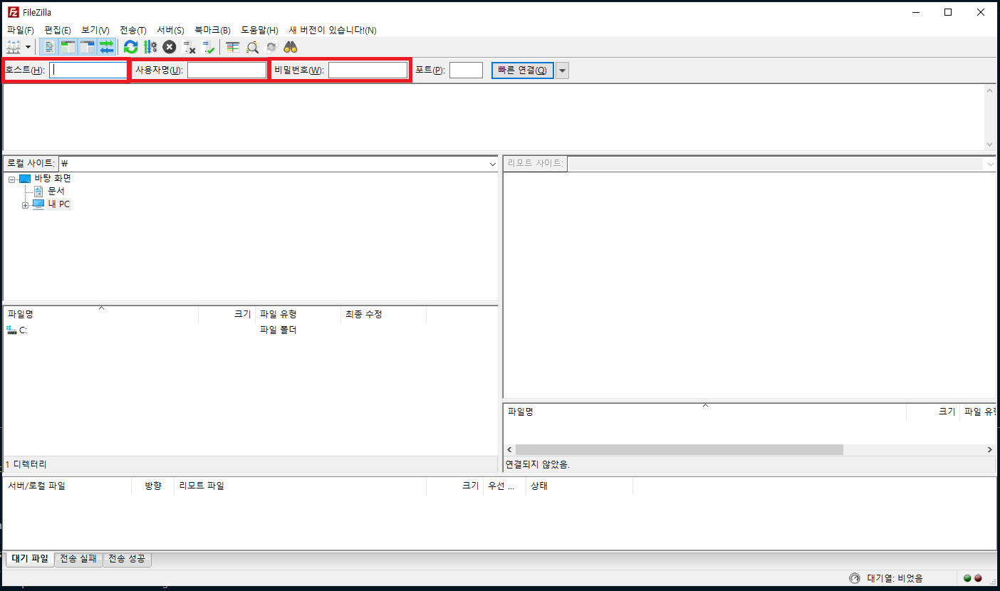
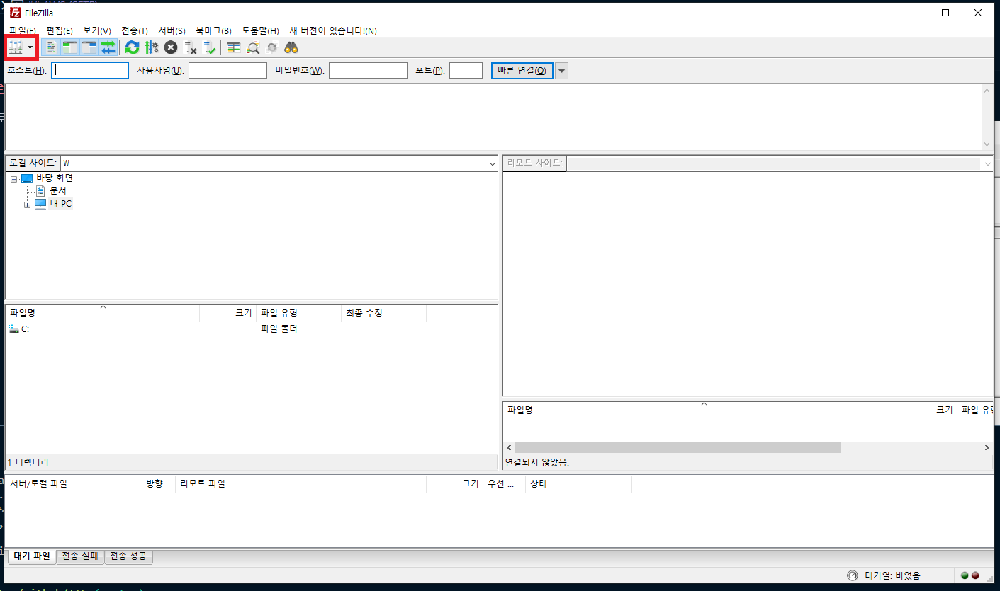
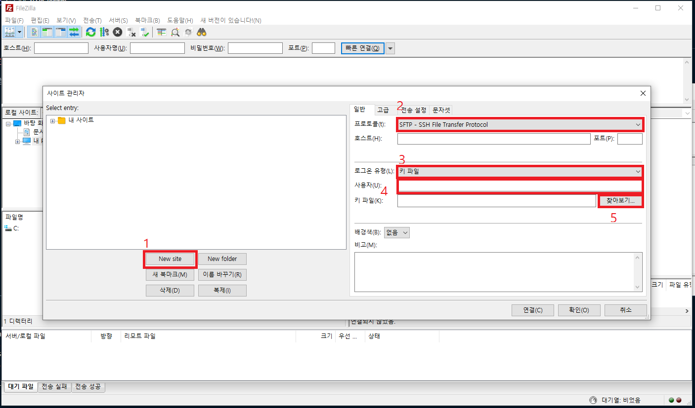

호스트 : 주소 (IP)  

# 접속 방법
## FTP

``호스트 , 사용자명 (FTP - ID) , 비밀번호 (FTP - PW)``  
보통 호스팅 업체를 사용하며 , 호스팅 사이트에서 FTP 정보 확인할 수 있다

## AWS (SFTP)

빨간색 영역 클릭  
  

1. 새로운 사이트 목록 생성
2. ``SFTP - SSH File Transfer Protocol`` 로 변경
3. 호스트 와 포트 입력 ( 1985 포트 : 22)
4. 로그인 유형 : ``키 파일`` 로 변경
5. 사용자명 입력 ( 1985 : ubuntu )
6. .pem 파일 연결